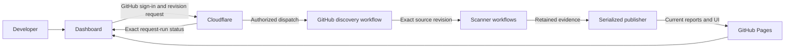

# External code-analysis service architecture

## Purpose

The service diagnoses security and engineering issues for developers. It analyzes an
exact repository revision, retains scanner-native proof, produces canonical findings,
and serves a searchable current snapshot. It is external to the application and has no
write path into source code, pull requests, Issues, deployment, or production.

## Repository structure

```text
.github/workflows/
  01..04                    scanner execution planes
  05                        exact-commit aggregation and Check
  06                        security-canary verification
  08                        manual branch-head orchestration
  09                        CodeRabbit advisory refresh

config/code-analysis/
  required-channels.json    explicit static publication policy
  proposal-tool-catalog.json all-channel identities, classes, and workflow definitions
  service-layout.json       executable module-ownership boundary

scripts/code_analysis/
  normalizer.py             canonical ingestion + SARIF/Sonar projections
  export_sonar_issues.py    bounded native Sonar API adapter
  collect_coderabbit.py     bounded AI-advisory GitHub adapter
  monitoring.py             identity/correlation domain
  evidence_contract.py      immutable artifact contract
  channel_status.py         publication-policy evidence validation
  provenance.py             exact-revision source proof
  snapshot.py               uniform snapshot-v2 analysis-channel assembly
  pipeline.py               application orchestration
  dashboard.py              presentation application
  dashboard_template.html   bounded developer UI
  audit_workflows.py        architecture/security policy
  validate_canary.py        detection-web contract
  benchmark_monitoring.py   scale gate
  test_service.py           service regression suite

docs/code-analysis/         operator, architecture, evidence, and handoff docs
```

## Dependency rule

The domain is deterministic and infrastructure-free. Adapters translate scanner or
GitHub data at the boundary. Application modules validate and assemble a snapshot.
Presentation consumes only that validated contract. GitHub Actions publishes the
immutable artifact. Nothing imports the Agentic SOC backend or frontend. All
implementation ownership stays in `.github/workflows/0[1-9]-*`,
`config/code-analysis/`, `scripts/code_analysis/`, and `docs/code-analysis/`.
No analysis implementation file is owned by `backend/`, `webui/`, or an application
Compose profile.

## Developer diagnosis path

```text
exact commit
  -> complementary security/quality scanners
  -> immutable native artifacts
  -> adapters and normalizer
  -> canonical finding + all observations
  -> loop-safe outbound Sonar projection (deterministic code-local only)
  -> reconciled publishable snapshot
  -> security-focused and complete dashboard views
```

A developer can start at a security count, filter by concept/component/path/scanner,
open one canonical finding, inspect every contributing rule and native result, and
follow the exact workflow/artifact proof. AI candidates remain a separate
`AI_ADVISORY` view and never enter the Sonar projection. Issue Wall records what was
reported; it does not own assignment, acceptance, suppression, closure, or vendor state.

## Change discipline

`service-layout.json` is validated in CI. Missing declared files, undeclared layer
names, forbidden application runtime dependencies, unsafe Actions, and unbounded jobs
fail the Code Quality workflow. Stable script paths remain compatibility entry points;
internal extraction into packages can occur incrementally without breaking automation.


## Published observation contract (snapshot-v2)

`analysis_channels` is the only published channel inventory. Each catalogued channel is
present with `channel`, `name`, `class`, `status`, `findings` (integer or null),
`observation_count`, `observation_ids`, `reason`, `workflow`, `artifact_files`,
`status_artifact`, and `evidence_source`. Counts are canonical finding counts; native
observations retain independent membership and severity. No source observation is
silently dropped or assigned to multiple channels. Missing channel finding evidence is
null; completed scans can report an explicit zero. A status artifact is named separately
from scanner result artifacts. A configured workflow is not proof of a completed run.

The catalog has five purpose classes and no required/optional state hierarchy. Its
classification drives both Observatory filtering and role coverage. The catalog does
not control publication eligibility. The separate `publication_gate` keeps the existing
static-evidence-v1 manifest policy; all its listed channels must be COMPLETED. The
intermediate channel-status.json artifact remains that policy validator's output, not
a second published observation inventory.

The pipeline, renderer, summaries, launch guide, and benchmark use snapshot-v2. The
renderer rejects legacy or split inventories, missing/duplicate identities, invalid
classes/counts, broken observation membership, and incomplete gate evidence. Existing
v1 offline artifacts remain immutable and self-contained; new reports require
regeneration rather than an implicit metadata backfill.

## Current hosted dashboard (2026-09-07)

The implemented direction is one public React/TypeScript/Vite application, published
from the dedicated `combustrrr/code-analysis-dashboard` repository to GitHub Pages.
The analysis host is `combustrrr/Agentic-Kibana`; the configured read-only source is
`ARYDESTROYER/Kavach-AgenticSOC`, with `Testing` selected by default. This supersedes
the earlier R2, private-hosting, third-party UI, and historical-storage proposals.

`config/code-analysis/service.json` supplies source/host/publisher identities, preferred
branch, concurrency, retention, site capacity, and trusted repository commands.
Hourly discovery enumerates all upstream branches and open PRs. A successful complete
inventory replaces active membership; API errors never mean that targets disappeared.
The host keeps its bounded current queue in the `current-analysis-state` release body.
At most two source analyses run concurrently, with Testing then PRs prioritized.
Completion events reconcile the queue between hourly discovery runs.

Legacy scanner workflows 01-04 and 07 are manual entry points. They no longer launch
duplicate fork-head scans on tooling pushes or a separate DAST schedule. Automatic
upstream analysis flows through discovery 10 and exact-source workflow 11, avoiding
competing automatic Sonar analyses and unnecessary vendor quota consumption.

The generated exact-source workflow derives scanner steps from existing definitions,
checks out immutable source and trusted tooling separately, and assembles evidence from
one producer run and attempt. It grants no source job publishing privileges and persists
no checkout credentials. Vendor secrets are restricted to relevant scanners; source
installation/test jobs do not receive publishing credentials. Changes to legacy scanner
definitions require regenerating the exact-source workflow. CodeRabbit collection for
explicit PR targets handles fork source repositories and requires exact-head evidence.

Hosted validity is separate from completeness. Snapshot-v2 canonical findings and
observations remain authoritative; its static-evidence-v1 gate is preserved unchanged.
The hosted-report-v1 envelope permits valid partial reports, retaining failed channels
and null unavailable counts. Legacy offline generation remains strict. Policy findings
are completed scanner execution, and coverage reports retain test exit status.

The dedicated publisher is serialized and periodically reconciles the host queue and
upstream heads. It downloads only explicitly identified producer artifacts, validates
source/target/tooling/attempt identity, and rejects superseded revisions. Current reports
are compressed managed assets on its `current-reports` release; the release body is the
small active manifest. Replacement assets are uploaded before references change. Cleanup
runs only after successful deployment and removes only unreferenced managed report assets.
Artifact handoff retention is seven days; active reports do not depend on artifact expiry.
No generated report history is committed to Git, and there is no history browser.

A matching UI build is cached independently of report data. Publications assemble the
whole active collection, compress static JSON for explicit browser decompression, and
reject deployments at 900 MB. Source snippets are content-addressed, findings details
are paginated, and selection loads only that target's data. Every target shows discovered
head, analyzed SHA, last discovery time, analysis time, scanner status, and run links.
A previous report remains visibly stale during a new scan; partial results never borrow
findings from older revisions. Optional authenticated launch controls call a separate
Worker; GitHub credentials and workflow dispatch stay behind that boundary.

The site is public. Detected Gitleaks values are withheld from public finding messages,
and source previews for affected files are withheld. Scanner text is rendered as text,
not HTML. Findings remain observations rather than verified defects. The implementation
is isolated from the Agentic SOC runtime and its existing documentation Pages site.

Operational acceptance requires live branch and PR scans, every applicable non-deferred
scanner's evidence, publication recovery, and browser checks. Missing vendor entitlement
or upstream posture permissions remain explicit blockers; they must not be renamed
as deferrals. Operational status must reflect actual rollout and verification results.

Every configured channel is a delivery requirement. Installation, dispatch, an advisory
green job, or a published partial report does not establish that a channel works. Each
channel needs a real exact-source run, usable native evidence (including verified zero
findings), successful ingestion, and visible issue/status provenance. `NOT_APPLICABLE`
requires an actual missing source input or unsupported target context; it cannot hide
credentials, quota, licensing, execution, or ingestion failures. Additional requested
channels must satisfy this same acceptance contract before being called operational.

The dedicated public site is deployed at
`https://combustrrr.github.io/code-analysis-dashboard/`. Verified Testing producer
34147753825 analyzed upstream `8ecba4956d1b05c143b52f372e2e6a585bc00134`, publishing
21,439 findings from 22,162 observations. Live Chrome checks passed for filtering,
immutable source navigation, supporting observations, direct links, and mobile layout.
Earlier runs exposed source/tooling contamination; those reports are rejected, and
their successful dynamic jobs are not treated as proof of upstream execution.
Native Scorecard JSON now validates the selected repository and commit. Malformed
outputs remain invalid evidence and preserve a failed strict gate while usable
observations can publish.
Snyk uses an explicit manifest profile and wheel metadata only: it never installs
source package code in the vendor-token job. Native Sonar export and upstream
secret-protection permissions remain operational checks, not assumed capabilities.

Scanner selection is explicit in `enabled_scanners` and `deferred_channels`; every
known channel must appear in exactly one, and a deferral requires a reason. Channels
sharing one producer are configured together. The trusted identity job inspects the
exact checkout for configured project roots before dispatching project-dependent
jobs. Generated documentation branches without those projects show explained
`NOT_APPLICABLE` channels, while repository-wide scanners remain enabled. This does
not change the legacy strict evidence gate or turn missing evidence into zero findings.
Hadolint is also inapplicable when neither configured shipping Dockerfile exists.
OSV is inapplicable without its configured manifests; Actions security is inapplicable
without workflow definitions, while repository posture still runs. Native Scorecard
checks that cannot evaluate a selected commit remain explicitly unavailable.

To retry after credentials or vendor evidence become available, run **Discover upstream
analysis targets** in the analysis fork's Actions tab with `refresh_target` set to a
branch name, `PR #number`, or dashboard target ID. The explicit retry persists while
the two slots are occupied and keeps every other active target. It does not require
an upstream commit or browser credentials. Empty input performs normal discovery.

Trusted scanner tooling is moved into the runner's temporary directory before
scanning; it is never a child of the source scan tree. Atheris receives the source
backend path explicitly and verifies its checked-out Git SHA before importing it.
Hosted reports attest `source_boundary: isolated-tooling-v1`; the publisher rejects
earlier reports and any finding that points into the tooling checkout. Finding
indexes, detail pages, and observation references must also reconcile after download.
The API startup/fuzzing and JavaScript test commands execute through the repository
profile, retaining test exits and operational failures separately from findings.

Dispatch records the run ID returned by GitHub. A unique persisted request nonce
supports recovery only when acknowledgement was lost. Expired handoff artifacts are
requeued when no durable published report exists; already-published reports survive
artifact expiry. Immutable release assets are reused without delete-and-replace.
Sonar export verifies the vendor analysis ID and source revision before and after
pagination so concurrent analyses cannot be mislabeled as the requested commit.

Useful commands:

```shell
python -m scripts.code_analysis.generate_source_workflow
python -m unittest scripts.code_analysis.test_hosted scripts.code_analysis.test_service
python scripts/code_analysis/audit_workflows.py
cd analysis-ui
npm ci --ignore-scripts
npm run build
```

The standalone browser tests consume the retained-report fixture under ignored
`analysis-ui/public/data`; scanner findings and source files are never committed there.
The deployment workflow template lives in `config/code-analysis/dashboard-pages.yml`.
GitHub Pages size/usage limits and scanner OSS entitlements must be checked at rollout;
free standard public runners do not promise unlimited artifact or commercial-vendor use.

The standalone dashboard uses Ant Design for navigation, target selection, severity
statistics, issue/scanner tables, operational alerts, and the keyboard-accessible
source drawer. Its shared theme and responsive styles live only in `analysis-ui/`.
Issue routes remain shareable hash links; selecting a finding loads retained exact-
revision evidence without running analysis. Scanner execution remains a separate view.

The reference-inspired dark dashboard adds a compact identity header, overview
severity distribution, directory counts, and distinct-scanner overlap. Directory
counts are not normalized risk scores; scanner overlap is not a confidence estimate.
Desktop issue browsing keeps retained source evidence beside a compact finding list;
small screens use the accessible drawer. Scanner category/status filters and a
Provenance view expose the existing report contract. PR delta, AST traces, automated
fixes and cryptographic certification claims are not inferred from these views.

The dashboard supports persistent light/dark appearance and a Run analysis dialog.
The dialog supports authenticated launching through the configured Worker, with an
in-memory opaque session, and a GitHub Actions handoff when direct launch is unavailable.
The handoff keeps the workflow branch on the fork default and supplies `refresh_target`:
a typed repository/revision selection, active branch, PR number, full upstream commit
SHA, or matching upstream GitHub URL. GitHub resolves exact identities before queueing.
One manually selected commit or non-active PR is retained alongside active discovery
targets; the next such selection replaces that slot. PR snapshots preserve fork source
and base/head context. This adds explicit revision inspection without historical browsing.
Reports refresh automatically every minute with uncached fetches, or on Refresh results.
Publication reconciles about every ten minutes; source-head discovery remains hourly.
These intervals are polling cadences, not a real-time completion guarantee.

Scanner and repository extension points are documented in [Scanner and repository
integrations](INTEGRATIONS.md). Trusted `scanner_extensions` registrations generate
isolated source or vendor jobs. Versioned channel evidence is validated and joins
the existing canonical report, so new channels need no frontend changes.


## Authenticated launching (2026-09-08)

The user-approved direct-launch flow adds GitHub sign-in through a Cloudflare Worker.
The Pages UI offers the configured repository, separate branch/PR/commit selectors,
live authenticated target discovery, a source preview, and a Start analysis action.
The Worker checks the developer's current write permission on the analysis fork and
submits a structured selection to its trusted default-branch discovery workflow.
The existing current-only reports, two-analysis limit, scanner boundaries and publisher
remain authoritative. Public browsing remains anonymous; launching requires GitHub.
The earlier no-login constraint now applies only to viewing results.

The current instance points at its deployed Cloudflare Worker and private GitHub App.
See [authenticated launch setup and acceptance](AUTHENTICATED_LAUNCHING.md). A successful
OAuth launch does not by itself establish scanner completion or resolve vendor blockers.

## Integrated application connections

The standalone dashboard includes a **Connections** workspace, available even when
no target has a report. It shows the source repository, Cloudflare gateway, scanner
execution repository, publication repository, and GitHub session. Authenticated
verification reads `config/code-analysis/service.json` from the execution repository's
actual default branch and checks the configured discovery workflow. A configuration
match confirms routing, not scanner coverage or successful analysis.



`GET /api/integration` verifies the live execution configuration without running source
code. `GET /api/runs/{id}` reads only the configured repository's discovery workflow
runs. Both require the existing same-origin bearer session and recheck the user's
write access; neither exposes raw GitHub API objects or credentials.

The request banner checks the exact discovery run every 20 seconds while it is
active and the user is signed in. A completed discovery run does not mean scanners
completed. Scanner state and new report availability still come from the published
inventory, refreshed every minute. The canonical analyzed SHA, producer runs, and
channel evidence remain authoritative. Status errors preserve the GitHub run link
instead of inventing progress; signing out stops authenticated polling.
