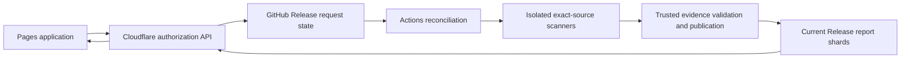

# Current service architecture

Current as of 2026-09-11. See [handoff](../HANDOFF.md) and
[current state](CURRENT_STATE.md) for deployment evidence and remaining exceptions.

## Ownership

`combustrrr/code-analysis-dashboard` owns the React/TypeScript/Ant Design UI,
Cloudflare Worker, trusted scanner adapters, reusable workflows and current reports.
Agentic SOC runtime and product CI are independent. The product fork and Kavach
upstream are observer sources; the App is installed only on the service repository.
A connected project can report to its own exact commit; observer projects never
upload SARIF/checks to an unrelated fork SHA or write upstream.

## Request and result path

The Worker uses GitHub App/user authorization for repository inspection, reviewed
installation/configuration, launch, activity and report access. It does not execute
source code. Public GitHub storage is durable; no R2, D1, VM or findings database is
provisioned. Keep free-plan usage bounded; do not purchase services automatically.

The default-branch `.github/code-analysis/projects.json` contains execution identity,
source projects, profiles, scanner setup and immutable tooling. Installation writes
small wrappers and a profile only after an owner reviews and confirms exact files.
Admin is required for configuration, write permission for scan requests. Branch
protection blocks a direct commit rather than being bypassed.

Hourly complete paginated discovery, events and manual requests feed repository-local
serialized reconciliation. Resolve branch heads at processing; validate full SHA
and preserve PR source/head/base context. Two analyses run concurrently; pending
intent stays durable. Exact run/attempt provenance is mandatory. Source-only reuse
requires matching source, tooling and profile; PR-specific evidence retains context.
Source scripts execute without publishing/vendor credentials. Trusted vendor and
publication jobs remain separate.

## Current-report lifecycle

Managed Releases hold scheduler/request state and namespaced current-report assets.
Each project keeps one report per active branch/open PR and one bounded manual
selection. Upload replacement assets before changing manifest references; delete
unreferenced assets only afterward. Only a complete discovery pass removes deleted
targets. Late/superseded or mixed-revision results cannot overwrite current heads.
A valid partial report can publish, with the strict publication-gate evidence kept
honest. Completeness is separate from report validity and finding severity.

Seven-day Actions artifacts are handoff evidence. Current reports use compressed
shards with a 100 MB asset bound and default 900,000,000-byte project budget.
Capacity failures retain prior valid reports, not silently omit targets. Pages
contains application assets only; the obsolete aggregate 900 MB Pages report limit
is not the report budget. Data publication neither rebuilds UI nor runs scanners.

The UI loads selected-target manifests and details through the Worker, polls active
requests every 15 seconds and reports about every minute, and shows workflow progress
separately from published findings. Access and rate-limit failures remain explicit.
See [access](DASHBOARD-ACCESS.md), [maintenance](SCANNER-MAINTENANCE.md), and
[developer interface](MONITORING_UI.md).
